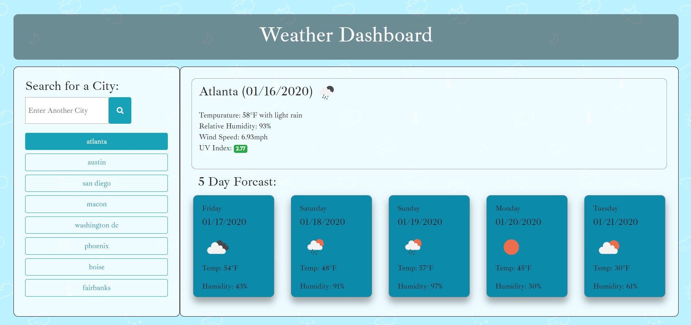

# weatherDashboard

## Table of Contents

* [Link](#link)
* [Description](#description)
* [Images](#images)
* [Usage](#usage)
* [License](#license)

## Link

[https://aagrosse.github.io/weatherDashboard/](https://aagrosse.github.io/weatherDashboard/)

## Description

A weather dashboard to display the current weather as well as a 5 day forecast for selected cities.  Enter your city in the input provided and click the search button. 

Current weather will display the following:

  *  Current conditions (displayed as an icon)
  
  *  Current temperature

  *  Current humidity

  *  Windspeed

  *  Uv index (will display as green, yellow, or red depending on the intensity)

A five day forcast will also be displayed showing the following:

  *  Date

  *  Current conditions (displayed as an icon)
  
  *  High temperature

  *  Current humidity

Cities will save as buttons in the panel and be clickable to re-access the weather data of past searches.

## Images

## Usage 

Use this to get weather info for different locations.

## License

no license needed.

